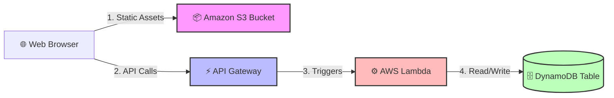

# AWS Certified Solutions Architect (SAA) Study Project: Serverless Web App

## 📌 Project Overview
This project serves as a practical implementation of serverless architectural patterns studied for the AWS SAA certification. It demonstrates a secure, decoupled, and scalable web application tier.

### SAA Concepts Practiced:
* **Stateless Compute:** Using AWS Lambda to automatically scale with demand.
* **Database Selection:** Utilizing Amazon DynamoDB for single-digit millisecond latency NoSQL data storage.
* **Security & IAM:** Enforcing least-privilege access execution roles.
* **Edge Routing:** Minimizing latency using Amazon CloudFront (Optional/Phase 2).

---

## 🏗️ Architecture Diagram
This diagram is rendered dynamically using Mermaid.js. It describes the request lifecycle from the user browser down to the database tier.

---

## ⚙️ Service Configuration & Deployment Log

### 1. Storage Tier (Amazon S3)
* **Bucket Name:** `saa-demo-web-hosting-xxxx` (Must be globally unique)
* **Configuration:** Enabled *Static Website Hosting*.
* **Security Check:** Adjusted *Block Public Access* settings to allow public read access specifically for website distribution, backed by an explicit bucket policy.

### 2. Database Tier (Amazon DynamoDB)
* **Table Name:** `SAA-Demo-Orders`
* **Partition Key:** `OrderID` (String)
* **Capacity Mode:** On-Demand (Optimized for unpredictable workloads and cost-efficiency during learning).

### 3. Compute Tier (AWS Lambda)
* **Runtime:** Node.js 18.x / Python 3.10
* **Execution Role Permissions:** Attached custom IAM policy granting *only* `dynamodb:PutItem` and `dynamodb:GetItem` actions to minimize attack surface.

---

## 🚀 How to Run and Test This Project
1. Clone this repository locally.
2. Open the AWS Console and deploy resources using the parameters mentioned above.
3. Update line 42 of `/frontend/app.js` with your generated **API Gateway Stage URL**.
4. Upload frontend files to your S3 bucket and visit the public S3 website URL.
